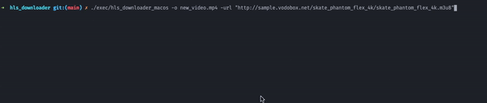

# HLS Downloader

A simple HLS downloader written in Golang, inspired by [hls-downloader](https://github.com/tuhinpal/hls-downloader).

## Dependencies

- [ffmpeg](https://ffmpeg.org/)

## Usage

- Clone the repository
- Run `make`, it will create a `exec` folder with the executable.
- Run `./exec/hls_downloader -url <url> -o <output>` to download the HLS stream.
    > Note: Default macos executable is generated with the name `hls_downloader_macos` not `hls_downloader`.

- Run `./exec/hls_downloader -h` to see all the available options.

## Test HLS Streams

You can test the downloader with the following HLS streams [Fazzani/free_m3u8.m3u](https://gist.github.com/Fazzani/8f89546e188f8086a46073dc5d4e2928)

ENJOY! ❤️
