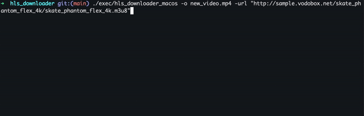

# HLS Downloader

A robust and feature-rich HLS (HTTP Live Streaming) downloader written in Go, inspired by [hls-downloader](https://github.com/tuhinpal/hls-downloader).



## Features

- **Master & Media Playlist Support**: Automatically parses and handles HLS master playlists with multiple quality variants
- **Adaptive Bitrate Selection**: Choose from available quality variants or automatically select the highest bitrate
- **Concurrent Downloads**: Parallel segment downloading with configurable worker pools for optimal performance
- **AES-128-CBC Decryption**: Built-in support for encrypted HLS streams with automatic key fetching and decryption
- **Retry Mechanism**: Exponential backoff retry strategy for failed segment downloads
- **Progress Tracking**: Real-time progress bar showing download status
- **Segment Stitching**: Automatic concatenation of downloaded segments into a single MP4 file using FFmpeg
- **Graceful Cancellation**: Proper cleanup and cancellation handling with SIGINT support
- **Verbose Logging**: Optional detailed logging for debugging and monitoring
- **URL Handling**: Smart URL resolution for both absolute and relative segment paths

## Dependencies

- **[FFmpeg](https://ffmpeg.org/)** - Required for stitching video segments into the final output file
  - Installation: [FFmpeg Download](https://ffmpeg.org/download.html)

## Installation

```bash
# Clone the repository
git clone <repository-url>
cd hls_downloader

# Build the executable
make
```

This will create an `exec` folder with the compiled binary.

> **Note**: On macOS, the executable is named `hls_downloader_macos` by default.

## Usage

### Basic Usage

```bash
./exec/hls_downloader -url <HLS_URL> -o <output.mp4>
```

### Command-Line Options

```bash
./exec/hls_downloader -h
```

| Flag | Description | Default |
|------|-------------|---------|
| `-url` | Master playlist direct URL (required) | - |
| `-o` | Output file path (mp4 format) | `timestamp.mp4` |
| `-p` | Number of concurrent workers | Number of CPU cores |
| `-f` | Override output file if it exists | `false` |
| `-h` | Always select highest bitrate variant | `false` |
| `-v` | Enable verbose logging mode | `false` |

### Examples

**Download with automatic highest quality:**

```bash
./exec/hls_downloader -url "https://test-streams.mux.dev/x36xhzz/x36xhzz.m3u8" -o video.mp4
```

**Download with custom worker count:**

```bash
./exec/hls_downloader -url "<HLS_URL>" -o output.mp4 -p 8
```

**Download with verbose logging:**

```bash
./exec/hls_downloader -url "<HLS_URL>" -o output.mp4 -v
```

**Override existing file:**

```bash
./exec/hls_downloader -url "<HLS_URL>" -o output.mp4 -f
```

## Test HLS Streams

You can test the downloader with the following HLS streams:

- **Example Stream**: [Big Buck Bunny Clip](https://test-streams.mux.dev/x36xhzz/x36xhzz.m3u8)
- **More Test Streams**: [Fazzani/free_m3u8.m3u](https://gist.github.com/Fazzani/8f89546e188f8086a46073dc5d4e2928)

## How It Works

1. **Fetch Master Playlist**: Downloads and parses the master playlist to identify available quality variants
2. **Variant Selection**: Displays available variants and selects the appropriate one (highest by default)
3. **Parse Media Playlist**: Fetches the selected variant's media playlist containing segment URLs
4. **Concurrent Download**: Downloads all segments in parallel using a worker pool
5. **Decryption** (if needed): Automatically decrypts AES-128-CBC encrypted segments
6. **Stitching**: Uses FFmpeg to concatenate all segments into a single MP4 file
7. **Cleanup**: Removes temporary files and directories

## Technical Details

### Encryption Support

The downloader supports AES-128-CBC encrypted streams:

- Automatically detects encryption keys in the playlist
- Fetches decryption keys from specified URIs
- Decrypts segments on-the-fly before stitching
- Supports both playlist-level and segment-level keys

### Performance

- Concurrent downloads with configurable worker pools
- Automatic worker count optimization based on CPU cores
- Exponential backoff retry for network failures
- Efficient memory usage with streaming downloads

## Credits & Acknowledgments

This project is built upon excellent open-source technologies:

- **[FFmpeg](https://ffmpeg.org/)** - Multimedia framework for video processing and segment stitching
- **[HLS Protocol](https://en.wikipedia.org/wiki/HTTP_Live_Streaming)** - HTTP Live Streaming specification by Apple Inc.
- **[grafov/m3u8](https://github.com/grafov/m3u8)** - Go library for parsing and generating M3U8 playlists

## Contributing

Contributions are welcome! Feel free to:

- Report bugs and issues
- Suggest new features
- Submit pull requests
- Improve documentation

Please ensure your code follows Go best practices and includes appropriate tests.

## License

See [LICENSE](LICENSE) file for details.

---

ENJOY! ❤️
